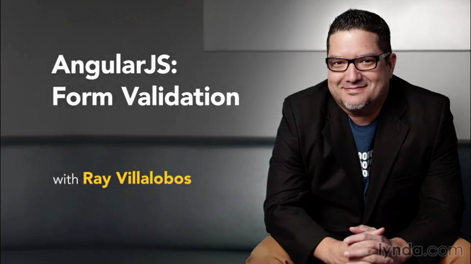

# Angular JS: Form Validation

This is the repository for my course, [AngularJS: Form Validation](#). The full course is available at [lynda.com](http://lynda.com).
- [My Personal Website](http://raybo.org)
- [All my Lynda.com courses](http://lynda.com/ray)

## Course Description
Validation is key to successful online forms. Implementing dynamic form validation that reacts to input can be difficult to implement with languages like JavaScript and jQuery. However, AngularJS allows you to take advantage of two-way data-binding functionality without having to write any JavaScript code. This makes reacting to input from the user—as it happens—a breeze.

In this short course, Ray Villalobos shows how to implement form validation on any HTML form using the built-in validation properties and methods in AngularJS. Together, you'll look at how AngularJS can help style forms dynamically as the user updates the content. Plus, explore how to implement validation with JavaScript, just in case you need more fine-tuned control of form interactions.

## Instructions

This repository has branches for each of the videos in the course. You can use the branch pop up menu in github to switch to a specific branch and take a look at the course at that stage. Or you can simply add /tree/BRANCH_NAME to the URL to go to the branch you want to peek at.

1. Make sure you have these installed
	- [node.js](http://nodejs.org/)
	- [git](http://git-scm.com/)
 	- [gulp](http://gulpjs.com/)
2. Clone this repository into your local machine using the terminal (mac) or Gitbash (PC) `> git clone https://github.com/planetoftheweb/angularformvalidation.git`
3. CD to the folder `cd angularformvalidation`
4. Run `> npm install` to install the project dependencies

For more help setting up a comprehensive Gulp.js workflow, check out [Web Project Workflows with Gulp.js, Git, and Browserify](http://www.lynda.com/Web-Web-Design-tutorials/Web-Project-Workflows-Gulpjs-Git-Browserify/154416-2.html).

## More Stuff
Check out some of my [other courses on lynda.com](http://lynda.com/rayvillalobos). You can also check out my [youtube channel](http://youtube.com/planetoftheweb), [follow me on twitter](http://twitter.com/planetoftheweb), or read [my blog](http://iviewsource.com).
